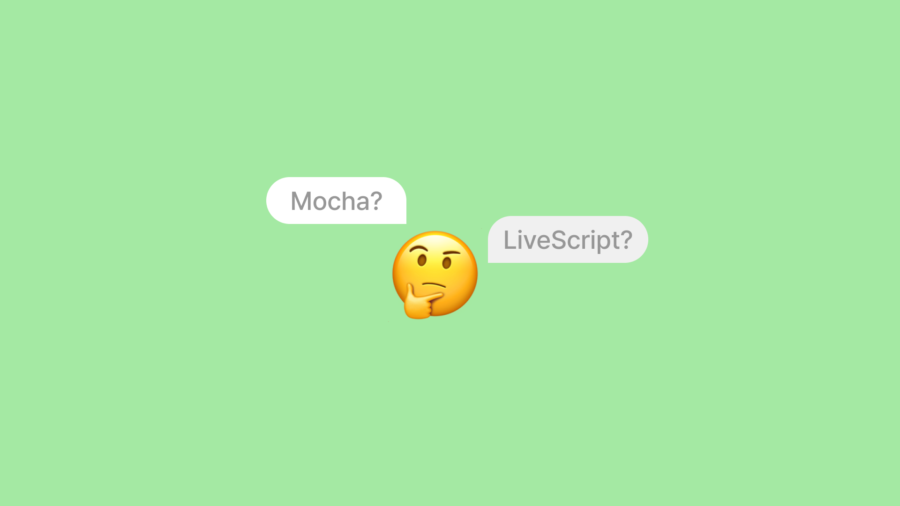
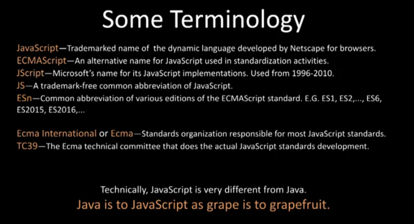
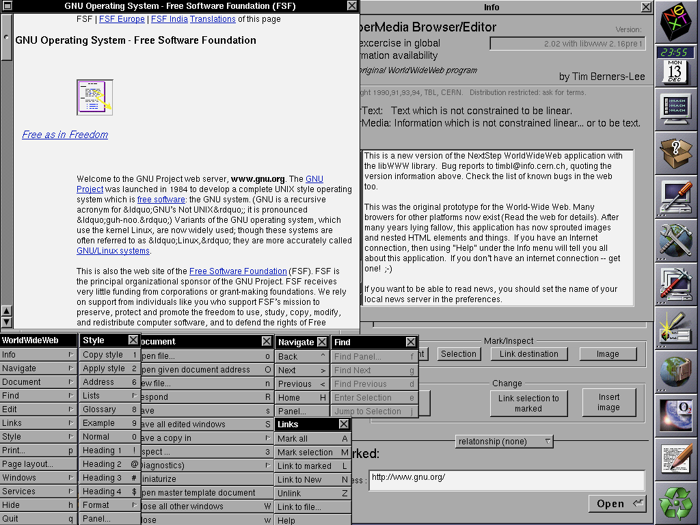
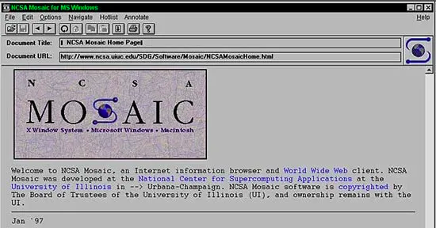
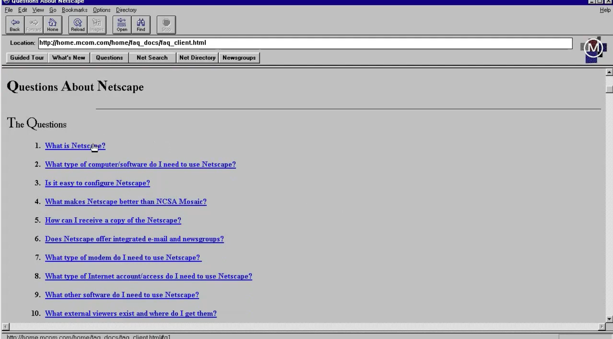
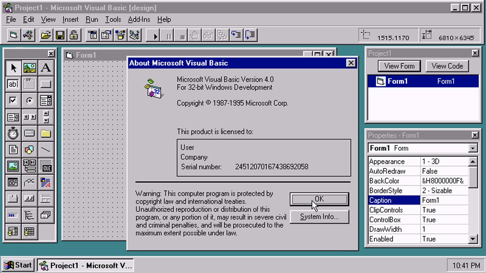
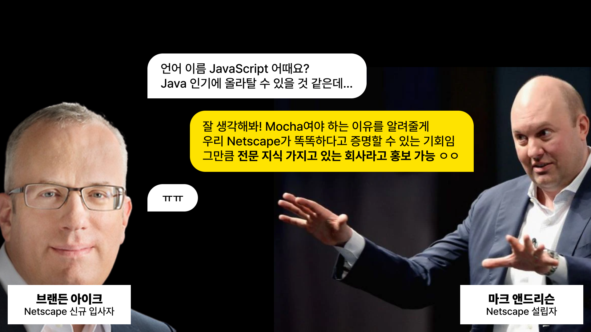
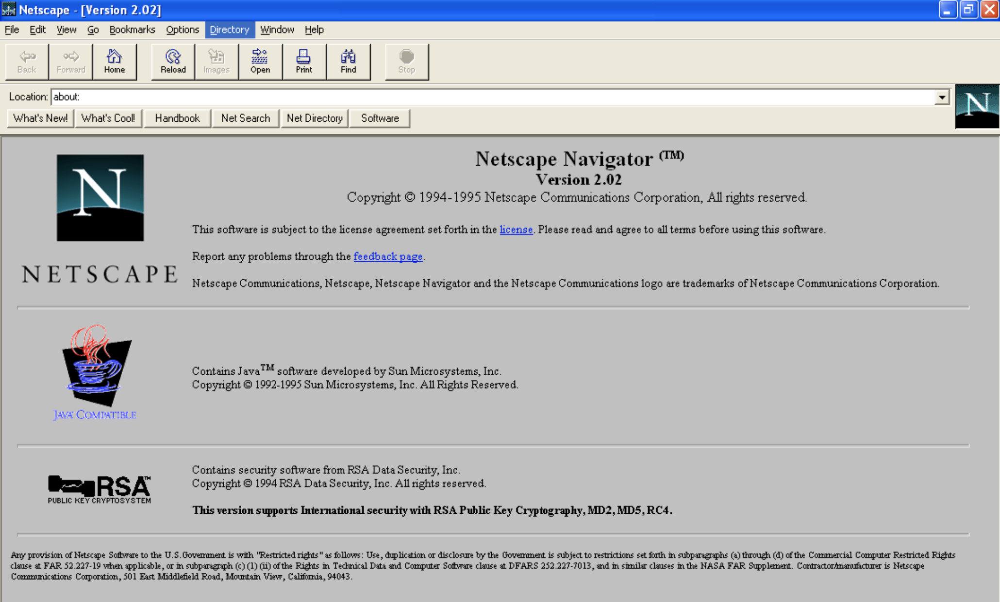

{/* eslint-disable */}

---

slug: 'history-of-javascript'
title: '📜 자바스크립트는 언제 시작되었나요?'
description: '역사를 잊은 민족에겐 미래는 없다...!'
tags: ['JavaScript']
createdAt: '2022-11-29 23:00:00'
updatedAt: '2022-12-25 23:00:00'

---

> [자바스크립트 등반 스터디](https://github.com/FECrash/JavaScript-Mountain) 발표 자료입니다.     
> [**JavaScript: the first 20 year**](https://dl.acm.org/doi/pdf/10.1145/3386327)를 참고하여 작성되었으나, 오역이 있을 수 있습니다.

자바스크립트의 역사에 대해 작성해보았습니다.

 
이 글을 보기 전 왜 이 글을 작성하였는지, 필요한 지식인지 궁금해하실 수 있습니다.
 

개인적으로 정리하며 들었던 생각은 브라우저가 어떻게 발전했는지 이해도 될 뿐만 아니라 깊게 공부할 수 있는 주제 중 가장 쉬운 주제가 아닐까 생각이 들었습니다.  
개념 같은 경우 배경 지식이 필요하나 역사의 경우 순서만 알면 술술 읽히기 때문입니다.

 
언어의 탄생 배경에 대해 이해하면 언어가 궁극적으로 해결하고 싶은 것이 무엇인지도 파악할 수 있습니다.

 
현재 글이 너무 복잡하다고 생각이 든다면 [드림코딩의 자바스크립트 역사](https://www.youtube.com/watch?v=wcsVjmHrUQg)
영상을 추천드립니다.

## 일부 용어 정리

- **JavaScript**: Netscape가 브라우저 용으로 개발한 동적 언어의 상호명
- **ECMAScript**: 표준화 작업에 사용되는 JavaScript의 대체 이름
- **JScript**: JavaScript 구현을 위한 1996년~2010년 마이크로소프트에서 사용된 이름
- **JS**: 상표가 없는 자바스크립트의 일반적인 축약형
- **ES(n)**: 다양한 버전의 ECMAScript 표준 축약형
- **Ecma International / Ecma**: 대부분의 JavaScript 표준을 담당하는 표준 조직
- **TC39**: 실제 JavaScript 표준 개발을 수행하는 Ecma 기술 위원회

> 기술적으로 JavaScript는 Java와 매우 다릅니다.  
> 포도(grape)와 자몽(grapefruit)의 관계처럼 Java와 JavaScript도 비슷합니다.
>
>  
> 한국어로는 코끼리와 바다코끼리처럼 아무 관계도 없습니다.

## 히스토리

### 1989~1991년, World Wide Web 개념의 탄생 + WorldWideWeb 브라우저

먼저 이 분이 누구인지 아시나요?

 
바로 **팀 버너스 리** (Tim Berners-Lee) 입니다.{' '}

 
World Wide Web의 개념과 기반 기술들은 1989~1991년에 팀 버너스 리에 의해 개발이 되었습니다.  
우리가 웹에 `www` 를 치는 것은 **WorldWideWeb의 약자**입니다. !

> [최초의 웹사이트](http://info.cern.ch/)가 궁금하신 분들은 해당 하이퍼링크로 접속할 수 있습니다! ☺️

### 1993년, Mosaic 브라우저의 탄생

World Wide Web의 개념은 **NCSA Mosaic**이라는 브라우저에서 대중화 되었습니다.  
1993년 당시의 브라우저는 이렇게 생겼었죠.

 
1990년대 초반의 웹은 대부분 텍스트 였고 이미지를 표시하기 위해서는 새 창을 열어 확인했어야 했습니다.

Mosaic는 이미지와 텍스트를 한 페이지에 표현할 수 있는 최초의 브라우저였습니다.

 
텍스트만 가득해 다소 지루했던 웹 세계에 급진적인 발전이 등장한 것이죠!

### 1994년 4월, Netscape 회사 창립

Mosaic는 대중에게 폭발적인 관심을 받았지만 개발 책임자였던 마크 앤드리슨이 동료들을 데리고 **Netscape**
라는 회사를 창립하게 됩니다. (초기에는 Mosaic Communications Corporation 이었습니다)

 
Mosaic을 대체하는 브라우저를 개발하기 위해 **Netscape Navigator 1.0**을 출시하여 가장 인기있는 웹 브라우저를
차지하게 됩니다.

<Callout icon={'❗'}>
  **Netscape plus Java kills Windows.** Netscape와 자바가 합쳐 Windows를 몰아낼 것이다!
</Callout>

1994년 말, Microsoft의 저가 인수 제안을 거절한 Netscape는 Microsoft를 이기기 위해 Sun MicroSystems 와 손을 잡게 되었습니다.

 
이후 Netscape에 Sun의 Java 기술을 브라우저에서 사용할 수 있도록 허가되었습니다.

### 1995년 4월, Brendan Eich의 합류

브랜든 아이크는 합류하여 Netscape의 **복잡한 제품 마케팅 및 프로그래밍 언어 상황**을 발견했습니다.  
더 간단한 스크립팅 언어의 필요성을 아래와 같은 이유로 내세우기 시작했습니다.

<Callout icon={'⚠️'}>
  1. Java는 아직 초심자가 사용하긴 어렵다. (진입장벽) 2. Microsoft에서는 아마추어, 파트타임
  프로그래머, 디자이너 등을 위해 어려운 Visual C++을 사용하기보단, `Visual Basic`을 이용해 쉽게
  윈도우 프로그램을 개발하도록 하였다.
</Callout>

### 1995년 5월, Mocha의 탄생

그렇게 Netscape Navigator 브라우저에 동적인 부분을 더할 목적으로 브랜든 아이크에 의해 10일 만에 Mocha가 개발되었습니다.

### 1995년 여름, Mocha를 이용한 Netscape 브라우저 개발

브랜든 아이크는 Mocha로 브라우저를 통합시키고, **JavaScript 기능 및 버그**를 작업합니다.

<Callout icon={'⚠️'}>
  여기에 JavaScript가 있는 이유를 개인 의견을 담아 이야기해보겠습니다.
   
  마크 앤드리슨은 언어의 이름을 “Mocha”로 제안했으며, Eich는 적절한 시기에 “JavaScript”로 바뀌길
  희망했습니다. 마크 앤드리슨은 회사 차원에서 단독적으로 개발한 언어이라 홍보가 가능하다 하고,
  브랜든 아이크는 언어 차원에서 Java 인기를 이용하길 원했습니다.
   
  그렇기에 개발 진행된 Mocha로는 브라우저 통합하고, **Mocha의 추가 개발은 JavaScript 라는 이름을
  이용해 하던 건 아닐까 생각이 들었습니다.**
</Callout>

### 1995년 9월, LiveScript 출시

LiveScript와 Java 1.0이 포함된 Netscape 2.0 베타 1 버전이 출시되었습니다.

위 1995년 여름에는 Mocha와 JavaScript로 싸웠지만 배포 시에는 LiveScript로 변경되어 출시되었습니다.

### 1995년 후반, Microsoft의 눈치 게임 시작

로버트 웰랜드가 IE에 Visual Basic을 넣기 위해 Microsoft에 합류하지만 넣기 위해선 **최소 2년 정도**가 걸린다는 말을 듣고 LiveScript의 원리와 구조를 파악하고 IE에 포함시키기 위한 자체적인 인터프리터를 개발하기 시작합니다.

### 1995년 12월, JavaScript로 개명

Netscape와 Sun이 함께 JavaScript에 관한 보도자료를 발표합니다.  
깐깐한 Java의 네이밍을 허락받았습니다.

### 1996년 6월, IE 3.0 베타 1에 JScript와 VBScript을 포함하여 배포

Microsoft는 JavaScript를 지원해야 하는 것에 만족하지 않았지만 무시하기에는 너무 늦었기에 IE에도 포함하여 배포합니다.

### 1996년~, JavaScript 표준화 프로세스 시작

브라우저 기술 발전에 따라 서로 다른 웹 브라우저에서 웹 페이지의 상호 운용성을 보장하기 위해 표준이 필요하다는 것이 분명해졌습니다.

 

Netscape와 Sun은 Microsoft가 웹 스크립팅 표준 개발을 지배하고 이를 Visual Basic 기반 언어에 다시 초점을 맞추려고 시도할지 모른다고 우려했습니다.  
Microsoft의 지배를 받지 않으며 인정받는 **표준 개발 조직인 Ecma Internation**을 통해 회의를 개최하여 표준인 ECMAScript를 만들기 시작했습니다.

> Mocha ► LiveScript ► JavaScript ► (part of JS resulted in) ECMA-262 ► ECMAScript ► JavaScript (consists of ECMAScript + DOM + BOM)

## 참고 자료

- [https://www.wired.com/2010/04/0422mosaic-web-browser/](https://www.wired.com/2010/04/0422mosaic-web-browser/)
- [https://ko.wikipedia.org/wiki/모자이크*(웹*브라우저)](<https://ko.wikipedia.org/wiki/%EB%AA%A8%EC%9E%90%EC%9D%B4%ED%81%AC_(%EC%9B%B9_%EB%B8%8C%EB%9D%BC%EC%9A%B0%EC%A0%80)>)
- [https://dl.acm.org/doi/pdf/10.1145/3386327](https://dl.acm.org/doi/pdf/10.1145/3386327)
- [https://www.pldi21.org/prerecorded_hopl.12.html](https://www.pldi21.org/prerecorded_hopl.12.html)
- [https://ko.wikipedia.org/wiki/%ED%8C%80\_%EB%B2%84%EB%84%88%EC%8A%A4%EB%A6%AC](https://ko.wikipedia.org/wiki/%ED%8C%80_%EB%B2%84%EB%84%88%EC%8A%A4%EB%A6%AC)
- [https://ko.wikipedia.org/wiki/%EC%9B%94%EB%93%9C%EC%99%80%EC%9D%B4%EB%93%9C%EC%9B%B9](https://ko.wikipedia.org/wiki/%EC%9B%94%EB%93%9C%EC%99%80%EC%9D%B4%EB%93%9C%EC%9B%B9)
- [https://www.wired.com/2010/04/0422mosaic-web-browser/](https://www.wired.com/2010/04/0422mosaic-web-browser/)
- [https://www.webdesignmuseum.org/old-software/web-browsers/mosaic-netscape-0-9](https://www.webdesignmuseum.org/old-software/web-browsers/mosaic-netscape-0-9)
- [https://www.thurrott.com/dev/232268/microsoft-plots-the-end-of-visual-basic](https://www.thurrott.com/dev/232268/microsoft-plots-the-end-of-visual-basic)
