<Callout>
**Create Date**: 2023/01/20   
**Update Date**: 2023/01/24
 

위 글은 [자바스크립트 등산 스터디](https://github.com/FECrash/JavaScript-Mountain)의 발표를 위해 만들어진 자료입니다. 

 
대부분 [Life of a pixel](http://bit.ly/lifeofapixel), [웹 성능 최적화에 필요한 브라우저의 모든 것](https://tv.naver.com/v/4578425)을
정리한 내용이며,  
[NAVER DEVIEW 2018 웹 성능 최적화에 필요한 브라우저의 모든 것 영상
요약](https://ssocoit.tistory.com/263), [Life of
Pixel](https://tecoble.techcourse.co.kr/post/2022-09-26-life-of-pixel) 글을 참고하였습니다.
(추가적으로 참고한 글은 참고 자료 부분에 작성하였습니다.)

</Callout>

브라우저가 페이지의 초기 출력을 위해 실행해야 하는 순서를 [Critical Rendering Path(CRP)](https://developer.mozilla.org/ko/docs/Web/Performance/Critical_rendering_path)라고 부릅니다.
저희는 오늘 Chrome 브라우저를 통해 이 과정에 대해 자세히 알아볼 예정입니다.

# 브라우저 렌더링 과정 미리보기

 79장](images/all.png)

출처: [bit.ly/lifeofapixel](http://bit.ly/lifeofapixel) 79장

# 사진에 있는 Blink는 뭔가요?

최근 크롬에서 사용하고 있는 **웹 렌더링 엔진**입니다!  
대략적으로 말하자면 Blink는 브라우저 탭 내에서 컨텐츠를 렌더링하는 모든 것을 구현한 것입니다.

 
Blink는 아래 사항을 포함합니다.

- DOM, CSS, [Web IDL](https://webidl.spec.whatwg.org/)을 포함한 웹 플랫폼 사양(ex: [HTML standard](https://html.spec.whatwg.org/))을 구현합니다.
- V8 엔진을 내장하고 있으며 JavaScript를 실행합니다.
- 기본 네트워크 스택을 이용해 리소스를 요청합니다.
- DOM 트리를 구축합니다.
- 스타일과 레이아웃을 계산합니다.
- [Chrome Compositor](https://chromium.googlesource.com/chromium/src/+/HEAD/cc/README.md)를 내장하며 이를 통해 그래픽을 그립니다.

렌더링 엔진은 표준이 없기에 브라우저마다 다른 엔진을 사용하곤 합니다.

파이어폭스는 모질라에서 직접 만든 게코(Gecko)엔진을 사용하고, 사파리와 크롬(28 버전 이전)에서는 웹킷(Webkit)을 사용합니다.

현재의 크롬(28 버전 이후)은 Webkit 지원을 중단하고 Webkit을 기반으로 한 Blink라는 새로운 웹 렌더링 엔진을 사용하고 있습니다.

](images/Untitled.png)

**출처**: [https://opentutorials.org/module/3800/22800](https://opentutorials.org/module/3800/22800)

# 0) 브라우저에서 시작하기

해당 부분은 [Chrome의 내부 동작 2편](https://areumsheep.notion.site/Chrome-2-4974f036e9464970bfdd72002602c529) 의 내용을 기반으로 정리하였습니다.  
내용을 정확하게 파악하기 위하여 [Chrome의 내부 동작 1편](https://areumsheep.notion.site/Chrome-1-259fd4448dfc4416ba98d041f497b9a6) 내용을 읽는 것을 추천드립니다.

](images/Untitled1.png)

**출처**: [https://developer.chrome.com/blog/inside-browser-part2/](https://developer.chrome.com/blog/inside-browser-part2/)

](images/Untitled2.png)

출처: [https://developer.chrome.com/blog/inside-browser-part3/](https://developer.chrome.com/blog/inside-browser-part3/)

## 0-1) 주소창에 값 입력하기

저희는 Chrome 주소창에 검색어 혹은 URL을 입력할 수 있습니다.  
그렇기에 Chrome은 검색어 일 때와 URL일 때를 판단하여 다르게 처리해야 합니다.

 
브라우저 프로세스의 UI 스레드가 입력되는 내용이 검색어인지 URL인지 확인합니다.
 
만약 검색어를 입력했다면 사용자가 선택한 검색 엔진의 URL과 조합하여 새로운 URL 형태로 변환하게 됩니다.
([prepopulated_engines.json](https://source.chromium.org/chromium/chromium/src/+/main:components/search_engines/prepopulated_engines.json)
파일 참고)

## 0-2) 내비게이션 시작하기

사용자가 Enter키를 입력하면 사이트의 콘텐츠를 가져오기 위해 UI 스레드가 네트워크 스레드를 통해 네트워크 호출을 시작합니다.

 
로딩 스피너가 탭의 왼쪽에 표시되고 네트워크 스레드는 DNS lookup과 TLS 연결 설정과 같은 적절한 프로토콜을
거치게 됩니다.

## 0-3) 응답 읽기

응답으로 header와 payload가 들어오면 네트워크 스레드는 필요한 경우 payload 스트림의 처음 몇 바이트를 확인합니다.

 
해당 단계에선 아래 작업들을 수행합니다.

- header의 Content-Type과 실제 응답받은 데이터 형식이 다를 수 있기에 [MIME 스니핑](https://developer.mozilla.org/en-US/docs/Web/HTTP/Basics_of_HTTP/MIME_types)을 실행하여 데이터의 실제 형식을 알아냅니다.
- 렌더러 프로세스가 다룰 수 없는 데이터 형식이라면 다운로드 매니저에게 데이터를 전달합니다.
- [Safe Browsing 검사](https://safebrowsing.google.com/)를 실행하여 도메인과 응답 데이터가 악성 사이트로 알려진 사이트와 일치하는 것 같다면 네트워크 스레드는 경고 페이지를 표시하라고 알립니다.
- cross-site 간 데이터가 렌더러 프로세스에게 전달되지 않도록 [CORB(Cross-Origin Read Blocking)](https://www.chromium.org/Home/chromium-security/corb-for-developers/) 검사가 수행됩니다.

## 0-4) 실행할 렌더러 프로세스 찾기

모든 검사가 끝나고 브라우저가 요청된 사이트로 이동해야 한다고 네트워크 스레드가 확신하면 네트워크 스레드는 UI 스레드에게 준비되었다고 알립니다.

 
네트워크 요청이 수백 밀리초가 걸릴 수 있기에 최적화를 진행합니다.
 
0-2단계에서 UI 스레드가 네트워크 스레드로 URL 요청을 보낼 때 UI 스레드는 이미 어느 사이트로 이동할 지
알고 있기에 UI 스레드는 렌더러 프로세스를 먼저 찾거나 네트워크 요청과 동시에 렌더러 프로세스를 시작하려
시도합니다.
 
모든 것이 예상대로 동작하면 네트워크 스레드가 데이터를 받을 때 이미 렌더러 프로세스는 준비 상태에 있습니다.

## 0-5) 내비게이션 실행하기

데이터와 렌더러 프로세스 모두 준비가 됐으므로 브라우저 프로세스에서 렌더러 프로세스로 IPC 메세지를 전송합니다.

 
렌더러 프로세스가 HTML 데이터를 계속 수신할 수 있도록 브라우저 프로세스는 데이터 스트림을 전달합니다.
 
렌더러 프로세스에서 내비게이션이 실행되었다는 것을 브라우저 프로세스가 확인하고 나면 내비게이션이 완료되고
문서 로딩 단계가 시작됩니다.

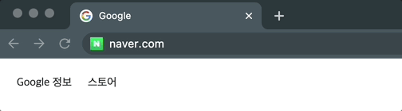

이때 주소 표시줄이 업데이트되고 보안 표시 및 사이트 설정 UI에 새 페이지 사이트 정보가 반영됩니다.

 
탭의 세션 기록이 업데이트되어 이전 / 다음 버튼으로 방금 탐색한 사이트에 이동할 수 있습니다.  
탭이나 창을 닫을 때 탭 / 세션 복원을 용이하게 하기 위해 세션 기록이 디스크에 저장됩니다.

# 1) 문서 로딩하기

해당 부분은 [Chrome의 내부 동작 3편](https://areumsheep.notion.site/Chrome-3-a91081b8ced84f9eb57e26ab90adfe5c) 의 내용과 [웹 성능 최적화에 필요한 브라우저의 모든 것 영상 자료](https://tv.naver.com/v/4578425)를 기반으로 정리하였습니다.

](images/Untitled3.png)

**출처**: [https://www.slideshare.net/deview/125-119068291](https://www.slideshare.net/deview/125-119068291)

지금부터 설명할 과정은 Renderer Process의 Main Thread 안에서 일어나는 작업입니다.

## 1-1) DOM 트리 생성하기

HTML 파일을 받더라도 컴퓨터가 HTML 파일을 그대로 인식할 수 없습니다.  
그렇기에 컴퓨터가 이해하는 형태로 파싱을 하는 과정이 필요합니다.

](images/Untitled4.png)

**출처**: [https://www.slideshare.net/deview/125-119068291/](https://www.slideshare.net/deview/125-119068291/)

DOM 트리를 사용하면 `<h1>` 태그의 텍스트를 Hello에서 Hi로 바꿀 때 해당 Node만 바꾸면 되기에 쉽게 추가하거나 삭제할 수 있습니다.

DOM 모델은 Document를 처리하는 모델에서 많이 사용됩니다.

](images/Untitled5.png)

**출처**: [https://www.slideshare.net/deview/125-119068291/](https://www.slideshare.net/deview/125-119068291/)

해당 트리를 그리는 과정을 자세히 이야기하면 위 사진과 같습니다.

브라우저는 기본적으로 HTML을 한 번에 처리하지 않고 데이터를 받을 때마다 조금씩 위 과정을 거치며 DOM 트리를 만듭니다.

 
HTML 파서의 첫 번째 특징은 **오류에 너그러운 속성**입니다.

<Callout>
🤔 **만약 `
Hello
` 같은 이상한 태그를 만나면 DOM 트리가 그려지지 않나요?**    
그렇지 않습니다! DOM 트리를 만들 때의 핵심은 바로 **예외처리**입니다.    
[HTML Standard](https://html.spec.whatwg.org/multipage/parsing.html#an-introduction-to-error-handling-and-strange-cases-in-the-parser)에 이상한 사례까지 처리가 되어 있기에 그려집니다. 다만 예외처리 방식에 따라 DOM 트리의 형태가 달라질 수 있습니다.

</Callout>

두 번째 특징은 **파싱 과정이 중단될 수 있다는 것**입니다.

       
HTML 파싱 도중 `<script>` , `<link>` 같은 외부에 접근해야 하는 태그를 만나면 HTML 파싱을 즉시 중단합니다. 이는 네트워크를 통해 먼저 받아온 코드부터 해석을 실행할 수 있는 HTML과 달리 외부 콘텐츠들은 증분적으로 해석할 수 없기 때문입니다.
          
또, `<script>` 에 DOM을 직접 수정할 수 있는 내용이 있을 수도 있기 때문입니다.   
이런 문제점을 해결하기 위해 스크립트는 별도 옵션인 `async` 와 `defer` 를 사용할 수 있습니다.

> 일부 브라우저는 [예측 파싱(Speculative parsing)](https://developer.mozilla.org/en-US/docs/Glossary/speculative_parsing) 기법을 이용해 별도의 스레드에서 외부 스크립트, 링크, 스타일을 불러오기도 합니다!

세 번째 특징은 **재진입성(Reentrant)** 입니다.

 
위에서 이야기했던 것처럼 HTML 파싱 과정은 어떠한 외부 요인으로 인해 방해받을 수 있습니다.

이런 경우에 HTML은 처음부터 다시 파싱 과정을 거칩니다. 이 때문에 처리해야 할 HTML이 많을 때는 파싱 시간이 오래 걸릴 수 있습니다.

## 1-2) CSSOM 트리 생성하기

HTML은 단순한 문서이기에 렌더링 방식에 대한 내용이 없습니다.  
대신 CSS가 렌더링 방식에 대한 정보를 모두 가지고 있습니다.

 
CSS를 파싱하는 과정은 DevTool에 표시되지 않습니다.

](images/Untitled6.png)

**출처**: [https://www.slideshare.net/deview/125-119068291/](https://www.slideshare.net/deview/125-119068291/)

CSSOM도 Cascade같은 상속 개념을 적용하기 용이하도록 트리 형태로 되어있습니다.    
CSSOM도 마찬가지로 JS API가 있으며 JavaScript로 CSS를 수정할 수 있습니다.

## 1-3) JavaScript 처리하기

JavaScript는 HTML 파싱, User Input, [requestAnimationFrame()](https://developer.mozilla.org/ko/docs/Web/API/Window/requestAnimationFrame), DOM Timer 등 다양한 경로를 통해 실행됩니다.

](images/Untitled7.png)

**출처**: [https://www.slideshare.net/deview/125-119068291/](https://www.slideshare.net/deview/125-119068291/)

웹킷 계열(iOS, 사파리)의 경우 인터프리터가 존재하여 JS를 파싱해 바이트코드를 실행합니다.

 
V8 엔진의 경우 JS를 받으면 JIT 컴파일 과정을 통해 머신 코드를 생성합니다.   JIT 컴파일 과정은 속도는
굉장히 빠르지만 컴파일 시간이 오래 걸리고 메모리를 많이 잡아먹습니다.
 
그래서 V8도 웹킷 계열의 인터프리터 장점을 받아들여 2017년에 Ignition이라는 인터프리터를 도입하였고, JS
코드를 받으면 먼저 인터프리터가 바이트 코드를 만들어 바로 실행하거나 필요한 경우 최적화를 위해 JIT 컴파일을
하는 과정을 거칩니다.

## 1-4) Render Tree 생성하기

DOM Tree와 CSSOM Tree 정보를 이용하여 Render Tree를 생성합니다.  
Render Tree는 화면에 렌더링하기 위한 정보를 가지고 있는 트리입니다.

 
DOM Tree와 비슷해보이지만 Render Tree는 HTML 파일과 1:1 관계를 가지고 있지 않습니다.
 
렌더링을 위한 트리이기에 화면에 보이는 요소들을 위주로 생성됩니다.  
즉, **화면에 보이지 않는 요소는 Render Tree에 들어가지 않습니다**.

](images/render-tree.png)

**출처**: [https://www.slideshare.net/deview/125-119068291/](https://www.slideshare.net/deview/125-119068291/)

예를 들어 Head에 들어가는 `<title>` 은 화면에 보여질 필요가 없기에 Render Tree에 들어가지 않습니다.

](images/Untitled8.png)

**출처**: [https://www.slideshare.net/deview/125-119068291/](https://www.slideshare.net/deview/125-119068291/)

위 그림은 DOM과 CSSOM을 합쳐 Render Tree를 만드는 구조를 표현한 그림입니다.

 
그림에 ‘web performance’ 라는 span 태그가 Render Tree에 그려지지 않은 것을 볼 수 있습니다.   display:
none이라는 CSS는 화면에 보일 필요가 없기에 그려지지 않은 것입니다.

## 1-5) Layout

브라우저 렌더링 엔진은 [CSS 2.1 스펙](https://www.w3.org/TR/2011/REC-CSS2-20110607/)을 이용하여 브라우저 내 CSS의 표준에 맞춰 제작되었습니다.  
그렇기에 브라우저 세계에는 모든 것이 박스로 구성되어 있습니다.

 
이러한 박스의 크기와 위치를 계산하는 과정이 바로 Layout입니다.  
레이아웃에는 전체(Global), 부분(Incremental) 레이아웃이 존재합니다.
 
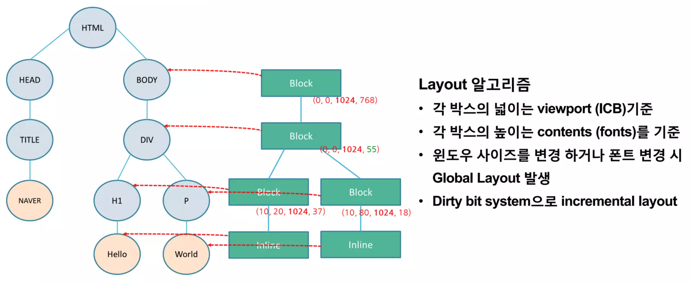

그림의 괄호는 viewport 기준 `(가로 위치, 세로 위치, width, height)` 를 가지고 있습니다.

 
일반적으로 브라우저의 박스 모델의 width는 부모 크기의 width를 기준으로 계산됩니다.   현재 그림에서
최상위 요소는 1024로 계산하고 있습니다.
 
여기에서 중요한 부분은 크기를 계산할 때 Global 레이아웃은 전체를 한 번에 레이아웃하고,   Incremental
레이아웃은 부분적으로 레이아웃하는 것을 의미합니다.
 
Global 레이아웃이 발생하는 두 가지 조건은 **윈도우 사이즈를 변경**하거나 **폰트를 변경하는 것**입니다.

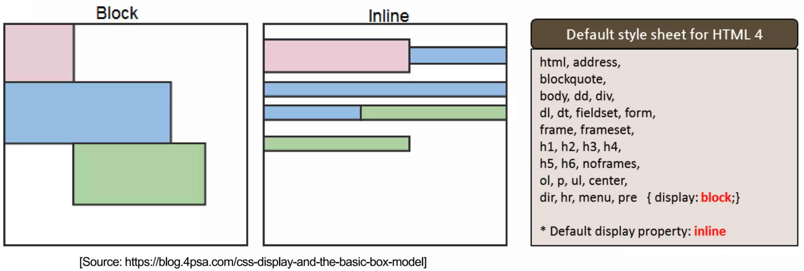

또 브라우저의 박스들은 block, inline 형태로 존재합니다.  
block의 경우엔 한 줄을 모두 사용하며(아래-위) inline은 좌우로(옆) 쌓이는 알고리즘을 가지고 있습니다.

 
요소들이 어떤 박스 타입인지는 가장 오른쪽에 명시되어 있습니다.   그렇기에 브라우저는 element의 박스
타입을 보고 레이아웃 작업을 진행합니다.

](images/Untitled11.png)

**출처**: [https://developer.chrome.com/blog/inside-browser-part3/](https://developer.chrome.com/blog/inside-browser-part3/)

결국 이 과정에선 오른쪽과 같은 레이아웃 트리를 만들게 됩니다.

## 1-6) Paint

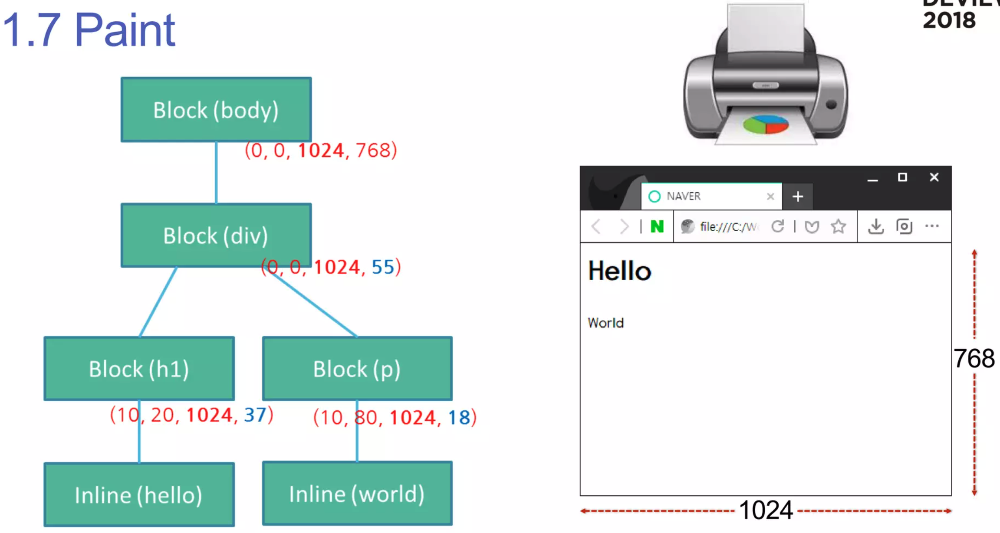

브라우저의 페인트 과정은 프린트하는 것과 비슷합니다.

 한 번에 확 렌더링되는 것이 아니라 프린터처럼 천천히 한 픽셀씩 그립니다.  
즉, 페인트를하기 위해선 Render Tree를 하나씩 그려야 합니다.

](images/Untitled13.png)

**출처**: [https://developer.chrome.com/blog/inside-browser-part3/](https://developer.chrome.com/blog/inside-browser-part3/)

이 과정에선 위 과정들과는 다르게 Tree가 아니라 **Records, 즉 순서에 대한 메모**를 생성하게 됩니다.  
해당 부분에 대해선 아래에서 자세히 다뤄보도록 하겠습니다.

# 잠깐! 변경된 브라우저 렌더링 플로우

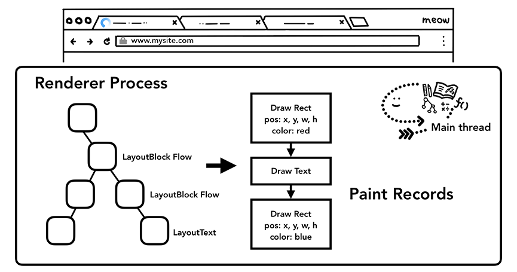

최신 브라우저에선 렌더링 하는 방식이 변경되었습니다.  
이전 렌더링 방식에선 로딩이 중심이었으나 이제는 로딩 이후의 과정이 중요해졌습니다.

 
여기서 새롭게 등장한 **Update Layer Tree**와 **Composite**에 대해 이야기해보겠습니다.

## 1-7) 여러 Layer로 분리하기

포토샵이나 Figma 같은 편집 툴을 사용해보셨다면 **Layer** 라는 개념에 익숙하실 겁니다.

 
브라우저의 레이어도 흡사합니다. 렌더링 될 요소들을 층 형태로 나누어 둔 것을 의미합니다.
 
그리고 Update Layer Tree는 렌더링이 될 최종 레이어들을 계산하여 생성하는 과정입니다.   이 과정에서도
Layer Tree를 생성합니다.

> **TMI**) 브라우저의 내부 자료 구조를 사람들이 Forest🌳  라고 부르곤 하는데 이렇게 다양한 트리가 생성되기 때문입니다….ㅎ

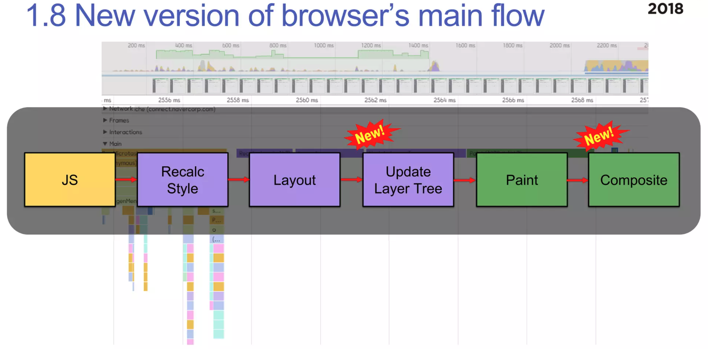

Layer가 생성되는 조건은 위와 같습니다.  
8번을 자세히 보시면 브라우저는 생성 조건 외에도 자체적으로 레이어를 생성하기도 합니다.

## 1-8) Raster

Raster Thread는 Record한 내용을 바탕으로 각각의 타일들을 비트맵으로 만들어냅니다.

](images/Untitled16.png)

출처: [https://ko.m.wikipedia.org/wiki/래스터화](https://ko.m.wikipedia.org/wiki/%EB%9E%98%EC%8A%A4%ED%84%B0%ED%99%94)

](images/Untitled17.png)

**출처**: [https://tecoble.techcourse.co.kr/post/2022-09-26-life-of-pixel/](https://tecoble.techcourse.co.kr/post/2022-09-26-life-of-pixel/)

](images/Untitled18.png)

**출처**: [https://tecoble.techcourse.co.kr/post/2022-09-26-life-of-pixel/](https://tecoble.techcourse.co.kr/post/2022-09-26-life-of-pixel/)

DisplayItem(렌더 트리, 레이어 트리)을 바탕으로 bitmap을 만드는 일을 rasterization이라고 부릅니다.  
그리고 이 rasterization은 일반적으로 GPU 안에서 이뤄집니다.

 
[chrome://gpu/](chrome://qpu) 에 접속하여 `Rasterization` 값으로 GPU 가속이 사용되고 있는지 확인할 수
있습니다.

](images/Untitled19.png)

**출처**: [https://tecoble.techcourse.co.kr/post/2022-09-26-life-of-pixel/](https://tecoble.techcourse.co.kr/post/2022-09-26-life-of-pixel/)

이렇게 rasterization 되고 난 뒤 screen에 pixel로 그리는 작업도 GPU에서 진행합니다.

 이 때 SKIA와 OpenGL을 사용하는데 SKIA 라이브러리에서 제공하는 API를 이용하면 OpenGL API로
변환됩니다. 즉, SKIA는 더 고수준의 API입니다.

<Callout>
🤩 구글 개발자 도구의 Rendering > Layer borders를 사용하면 레이어가 어떻게 나뉘어있는지 확인할 수 있습니다!

</Callout>

# 2) 화면을 그린 이후 일어나는 변화에 대응하기

](images/Untitled21.png)

**출처**: [https://www.slideshare.net/deview/125-119068291](https://www.slideshare.net/deview/125-119068291)

저희는 이제 화면을 모두 그렸습니다.

 
사용자가 스크롤을 하거나, zoom-in/out을 하거나 JavaScript로 style을 동적으로 바꾸면 브라우저는 이를 어떻게
처리할까요?
 
최근 대부분의 화면은 60fps, 즉 1초에 60번의 화면이 새로 변경됩니다. 즉, 16.67ms 안에 위에 설명한 과정을
완료해야 합니다…!

## 2-1) Invalidation

렌더링이 빠르게 되도록 하는 여러가지 방법 중 하나는 변한 부분만 업데이트하는 것입니다.

](images/Untitled22.png)

**출처**: [https://tecoble.techcourse.co.kr/post/2022-09-26-life-of-pixel/](https://tecoble.techcourse.co.kr/post/2022-09-26-life-of-pixel/)

DOM 노드의 style 변화가 생겼다면 다음 프레임 때 computedStyle(CSSOM)을 다시 구할 필요가 있기에 표시해둡니다. (SetNeedsStyleRecalc() 호출)

 
layout에 변화가 생겼다면 SetNeedsLayout만 호출하여 이전 단계를 거치지 않도록 할 수 있겠네요.

 
이렇게 변화가 있을 때 새로 계산하도록 표시하는 것을 invalidation이라고 합니다.

### Repaint

스크롤과 애니메이션 같은 경우는 너무 많이 변화되기에 위의 Invalidation 최적화 기법이 큰 효과를 보기가 어려울 것입니다.

](images/Untitled23.png)

**출처**: [https://tecoble.techcourse.co.kr/post/2022-09-26-life-of-pixel/](https://tecoble.techcourse.co.kr/post/2022-09-26-life-of-pixel/)

매 스크롤마다 Repaint와 Rasterization이 계속 발생하기 때문입니다. 이는 비용이 많이 들어가는 작업입니다.

### Jank

](images/Untitled24.png)

**출처**: [https://tecoble.techcourse.co.kr/post/2022-09-26-life-of-pixel/](https://tecoble.techcourse.co.kr/post/2022-09-26-life-of-pixel/)

위의 사례 외에도 JavaScript가 메인 스레드에서 실행되기에 코드 실행이 너무 오래 걸리면 버벅거림(jank)이 발생하게 됩니다.

## 2-2) Composite

그렇기에 invalidation 같은 최적화 기능도 있지만 scroll로 인한 repaint, rasterization & JavaScript 코드를 실행하는 비용이 많이 들어 rendering이 늦어지는 문제를 완화하기 위해 Compositing이 나왔습니다.

](images/Untitled25.png)

**출처**: [https://tecoble.techcourse.co.kr/post/2022-09-26-life-of-pixel/](https://tecoble.techcourse.co.kr/post/2022-09-26-life-of-pixel/)

Composite은 여러 레이어들을 합성하여 한 장의 비트맵으로 만드는 것을 의미합니다.

 
우리가 보는 웹은 단편적으로 보이기에 하나의 그림으로 보일 수 있지만, 그렇지 않습니다. 레이어별로 그린
후에 Composite 과정에서 합성을 하게 됩니다.
 
 이 기법을 Tiled Backing Store 기법이라고 하며 이 기법을 통해 화면을 재사용할 수 있습니다.
 {' '}

> [https://youtu.be/M2ORkIrHUbg?t=222](https://youtu.be/M2ORkIrHUbg?t=222)

해당 영상에선 배경을 그대로 두고 캐릭터만 바꾸며 다음 장면을 연출하고 있습니다.  
이것과 비슷한 방법으로 화면을 재사용할 수 있게 되는 것입니다.

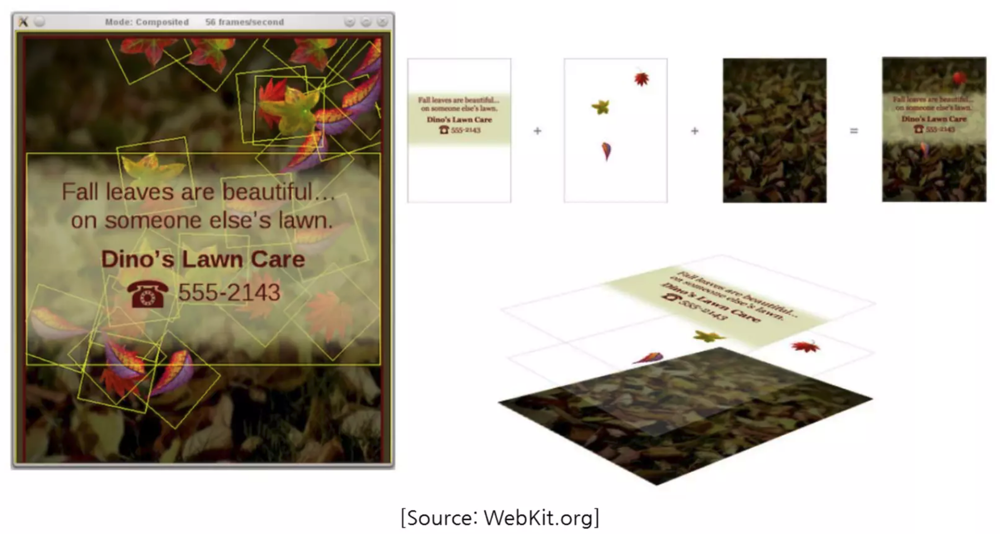

만약 브라우저에서 레이어링 기법을 사용하지 않고 한 장으로 렌더링을 한다면 왼쪽 사진의 나뭇잎이 떨어지는 애니메이션이 실행될 때마다 cost가 큰 paint 과정을 거치게 될 것 입니다.

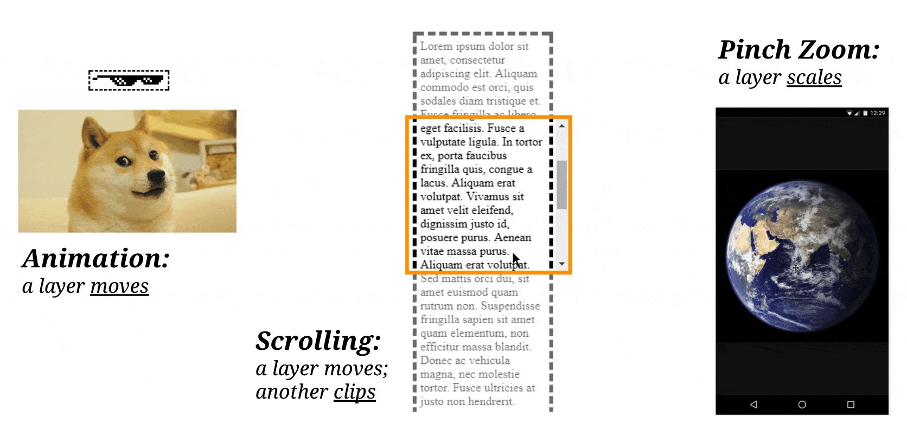

이렇게 레이어를 분리하여 rasterizing 한 후 생성된 bitmap만 변형하면 매 프레임마다 전체 페이지를 다시 그리지 않아도 되기에 효율적입니다.

](images/Untitled27.png)

**출처**: [https://developer.chrome.com/blog/inside-browser-part3/](https://developer.chrome.com/blog/inside-browser-part3/)

정리해보자면 컴포지터 스레드가 생긴 이후로는 레이어 트리와 페인트 순서가 담긴 페인트 레코드를 메인 스레드가 컴포지터 스레드에게 넘기면 컴포지터 스레드는 각 레이어를 타일 형태로 나눠서 Raster Thread에게 전달합니다.

### T**hreaded input**

](https://user-images.githubusercontent.com/52737532/192159834-9e3fd36d-b926-4f73-aa13-1a679b880bb5.png)

**출처**: [https://tecoble.techcourse.co.kr/post/2022-09-26-life-of-pixel/](https://tecoble.techcourse.co.kr/post/2022-09-26-life-of-pixel/)

메인 스레드가 바쁠 때 컴포지터 스레드는 브라우저 프로세스에게 사용자의 스크롤 입력을 받아 bitmap을 변경합니다.

물론 사용자가 특정 레이어가 아닌 전체 페이지를 스크롤링하면 컴포지터 스레드에서 처리하지 않고 메인 스레드로 일을 넘깁니다.   왜냐하면 전체 페이지를 다시 그리는 render pipeline을 거쳐야 하기 때문입니다.

 
추가로 JavaScript에서 scroll event listener를 걸어놓은 경우에는 사용자 입력을 main thread에서 처리하도록
task queue에 넣습니다.

# [최종,진짜_마지막] 정리

처음 첨부했던 이미지를 가져와 다시 순서를 나열해보겠습니다.

](images/Untitled28.png)

**출처**: [https://tecoble.techcourse.co.kr/post/2022-09-26-life-of-pixel/](https://tecoble.techcourse.co.kr/post/2022-09-26-life-of-pixel/)

](images/Untitled29.png)

**출처**: [https://www.slideshare.net/deview/125-119068291](https://www.slideshare.net/deview/125-119068291)

1. 브라우저가 web content를 받습니다.
2. DOM Tree를 생성합니다.
3. style을 계산합니다(resolve styles).
4. layout을 계산합니다.
5. layer를 만듭니다.
6. [property tree를 만듭니다.](https://tecoble.techcourse.co.kr/post/2022-09-26-life-of-pixel)
7. layer를 paint합니다.
8. layer + DisplayItemList(paint operations) + property tree를 compositor thread로 commit(복사/붙여넣기)합니다.
9. layer를 여러 작은 조각(tile)로 나눕니다.
10. SKIA library를 사용해 tile을 rasterizing 합니다.
11. DrawQuads를 생성합니다.
12. Skia와 OpenGL를 통해 DrawQuads를 실제 스크린에 그립니다. (pixel화)

# TMI) 과정을 통해 최적화하는 방법 이해하기

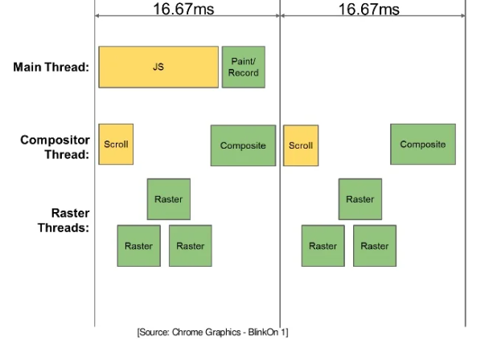

어떤 동작이 발생했을 때 어디를 수정해야 하는지를 아는 것은 굉장히 중요합니다.
오른쪽을 수정하면 수정할수록 빠르게 처리할 수 있습니다.

실제로 어떤 요소가 어떤 파이프라인을 동작하게 만드는지 궁금하시다면 [CSS Triggers](https://csstriggers.com/)를 사용해보세요!

## Layout 최적화하기

Layout이 효율적이기 위해선 element의 개수는 1,000개 정도로 제한하는 것이 좋습니다.

또, 불필요한 Layout cost를 줄이기 위해선 애니메이션을 처리할 때 `transform` 이나 `web animations` 를 사용하는 것이 좋습니다.

## Paint 최적화하기

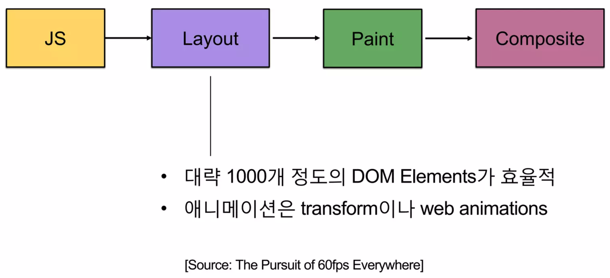

Paint 과정에서 GPU Rasterization을 사용하면 때에 따라 다르지만 10배 정도 빨라집니다.
이걸 사용하기 위해선 meta name에 viewport를 작성하면 됩니다.

그렇다면 웨일, 오페라, 크롬에선 콘텐츠를 GPU를 사용하여 렌더링하게 됩니다.

## Composite 최적화하기

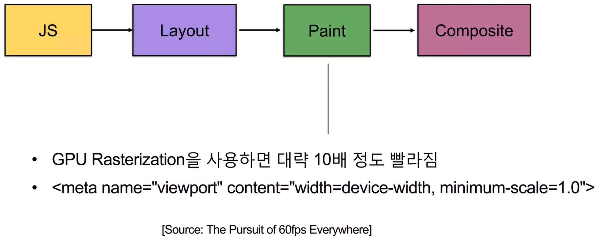

해당 과정에선 레이어들을 다루기 위해 메모리를 사용해야 합니다.
무작정 빠르다고 Layer를 늘리는 것보단 30개 정도의 Layer를 구성하는 것이 효율적입니다.

# 참고 자료

- Chrome의 내부 동작
  - [https://d2.naver.com/helloworld/9274593](https://d2.naver.com/helloworld/9274593)
  - [https://d2.naver.com/helloworld/5237120](https://d2.naver.com/helloworld/5237120)
  - [Chrome의 내부 동작 1편](https://areumsheep.notion.site/Chrome-1-259fd4448dfc4416ba98d041f497b9a6)
  - [Chrome의 내부 동작 2편](https://areumsheep.notion.site/Chrome-2-4974f036e9464970bfdd72002602c529)
  - [Chrome의 내부 동작 3편](https://areumsheep.notion.site/Chrome-3-a91081b8ced84f9eb57e26ab90adfe5c)
- Rendering Engine
  - [https://www.chromium.org/blink/](https://www.chromium.org/blink/)
  - [https://docs.google.com/document/d/1aitSOucL0VHZa9Z2vbRJSyAIsAz24kX8LFByQ5xQnUg/edit#](https://docs.google.com/document/d/1aitSOucL0VHZa9Z2vbRJSyAIsAz24kX8LFByQ5xQnUg/edit#)
  - [https://en.wikipedia.org/wiki/Comparison_of_browser_engines](https://en.wikipedia.org/wiki/Comparison_of_browser_engines)
  - [https://opentutorials.org/module/3800/22800](https://opentutorials.org/module/3800/22800)
  - [https://ssocoit.tistory.com/259](https://ssocoit.tistory.com/259)
  - [https://ssocoit.tistory.com/258](https://ssocoit.tistory.com/258)
- Life of a pixel
  - [https://www.youtube.com/watch?v=m-J-tbAlFic](https://www.youtube.com/watch?v=m-J-tbAlFic)
  - [https://docs.google.com/presentation/d/1boPxbgNrTU0ddsc144rcXayGA_WF53k96imRH8Mp34Y/edit#slide=id.ga884fe665f_64_6](https://docs.google.com/presentation/d/1boPxbgNrTU0ddsc144rcXayGA_WF53k96imRH8Mp34Y/edit#slide=id.ga884fe665f_64_6)
  - [**https://tecoble.techcourse.co.kr/post/2022-09-26-life-of-pixel/**](https://tecoble.techcourse.co.kr/post/2022-09-26-life-of-pixel/)
- 웹 성능 최적화에 필요한 브라우저의 모든 것
  - [**https://d2.naver.com/helloworld/59361**](https://d2.naver.com/helloworld/59361)
  - [**https://ssocoit.tistory.com/263**](https://ssocoit.tistory.com/263)
- Web IDL
  - [https://www.chromium.org/blink/webidl/](https://www.chromium.org/blink/webidl/)
  - [https://en.wikipedia.org/wiki/Web_IDL](https://en.wikipedia.org/wiki/Web_IDL)
  - [https://chromium.googlesource.com/chromium/src/+/master/third_party/blink/renderer/bindings/IDLCompiler.md](https://chromium.googlesource.com/chromium/src/+/master/third_party/blink/renderer/bindings/IDLCompiler.md)
  - [https://sites.google.com/a/chromium.org/dev/blink/webidl](https://sites.google.com/a/chromium.org/dev/blink/webidl)
- Slimming Paint
  - [https://docs.google.com/presentation/d/1zpGlx75eTNILTGf3s_F6cQP03OGaN2-HACsZwEobMqY/edit#slide=id.p](https://docs.google.com/presentation/d/1zpGlx75eTNILTGf3s_F6cQP03OGaN2-HACsZwEobMqY/edit#slide=id.p)
- 프론트엔드 개발자라면 알고 있어야 할 브라우저 동작 과정
  - [https://wormwlrm.github.io/2021/03/27/How-browsers-work.html](https://wormwlrm.github.io/2021/03/27/How-browsers-work.html)
- Software vs. GPU Rasterization in Chromium\*
  - [https://www.intel.com/content/www/us/en/developer/articles/technical/software-vs-gpu-rasterization-in-chromium.html](https://www.intel.com/content/www/us/en/developer/articles/technical/software-vs-gpu-rasterization-in-chromium.html)
