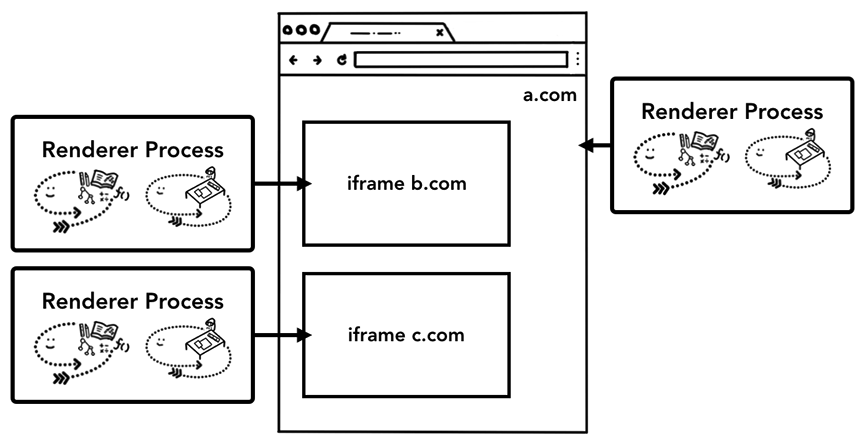
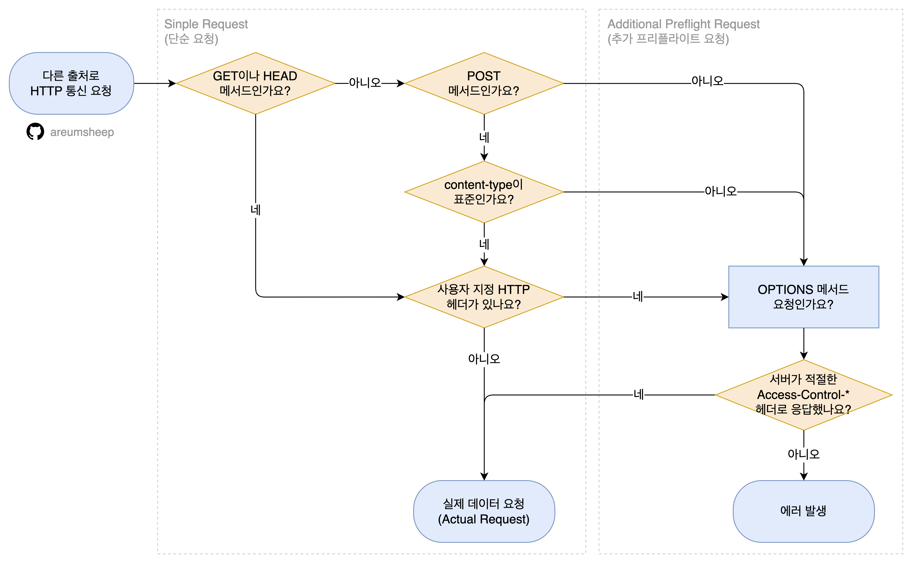
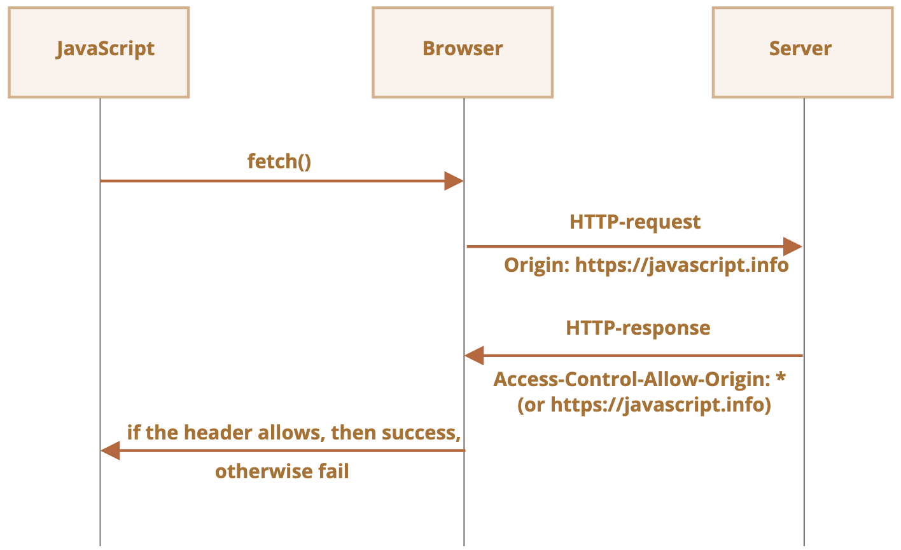
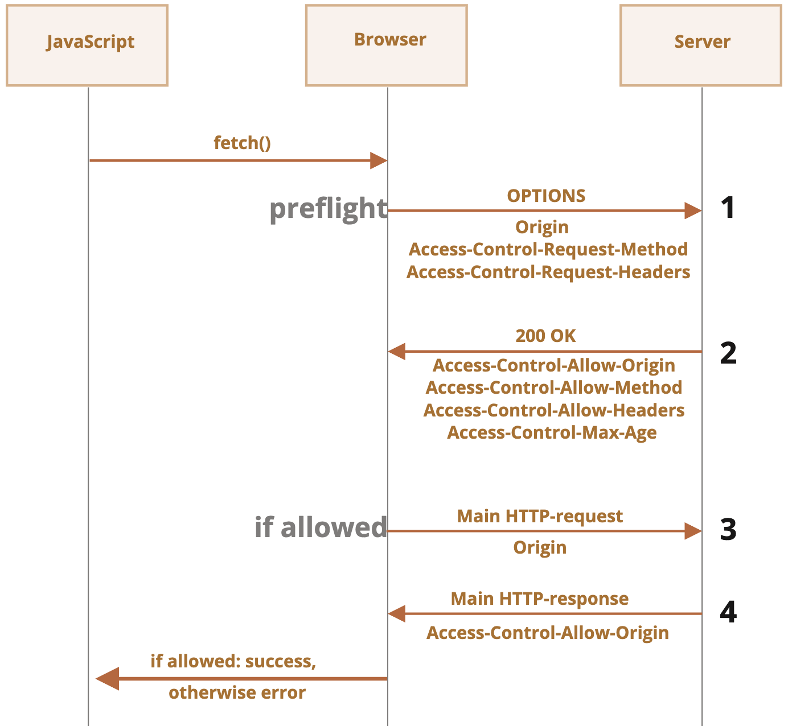
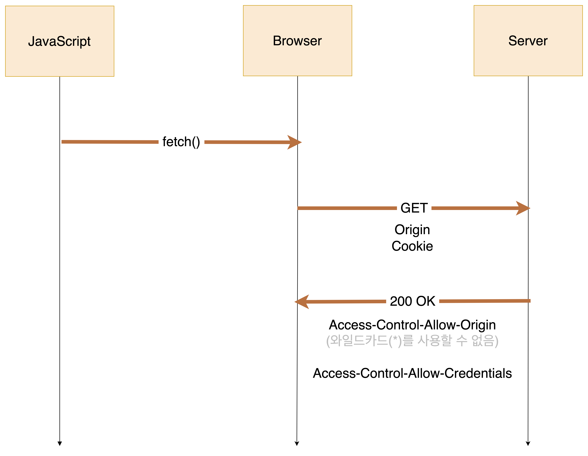
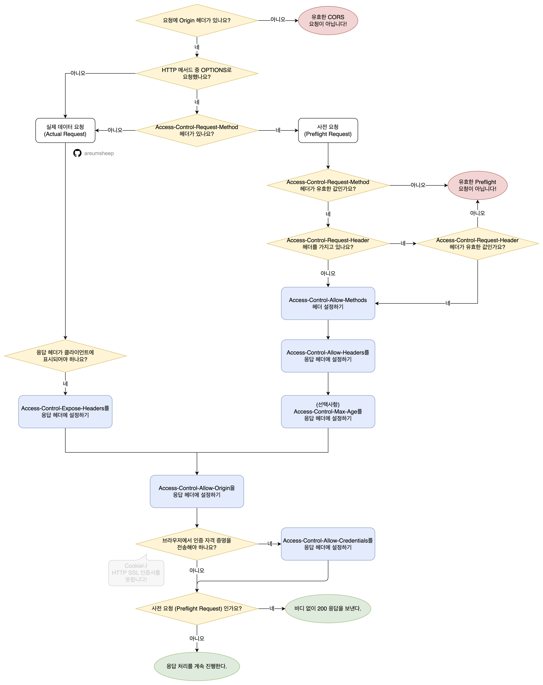

> [자바스크립트 등반 스터디](https://github.com/FECrash/JavaScript-Mountain) 발표 자료입니다.

CORS라고 불리는 교차 출처 리소스 공유는 하나의 메커니즘입니다.

<br />

웹사이트는 보안을 위해 기본적으로 다른 출처인 곳과는 통신을 할 수 없습니다.
그렇지만 CORS 안의 규칙들을 통과하게 되면 다른 출처인 곳과 통신을 할 수 있게 됩니다.


<br />
저희가 자주 보는 CORS 에러는 서버가 이 규칙을 지키지 못해 브라우저가 `규칙 좀 지켜줄래?` 하고 알려주는
것입니다.

CORS를 허용하는 규칙은 `Access-Control-Allow-Origin`를 서버와 동일한 URL로 맞추는 것 등등 다양하게 있습니다.

<br />
(자세한 내용은 **[🌸 CORS 동작과정 정리](https://velog.io/@reum107/CORS%EB%8A%94-%EC%99%9C-%EC%83%9D%EA%B2%BC%EC%9D%84%EA%B9%8C%EC%9A%94#-cors-%EB%8F%99%EC%9E%91%EA%B3%BC%EC%A0%95-%EC%A0%95%EB%A6%AC)**
에 flowchart로 설명되어 있습니다.)

---

아마 이 글을 읽으시는 분들은 대부분 CORS가 보안을 위해 존재한다는 것은 알고 계실 것입니다.
하지만 CORS는 오랜 기간 발전되어 온 결과입니다.

<br />
**처음부터 CORS 메커니즘을 브라우저에 적용시킨 것이 아닙니다.** 이 문장을 듣고 궁금증을 느끼셨다면 이
글이 도움되길 바랍니다.

> 그럼 이제부터 SOP를 넘어 XmlHTTPRequest, JSONP를 지나 CORS로 도달하게 된 과정에 대해 이야기해보도록 하겠습니다.

# 과거의 인터넷

](images/Untitled.png)

> 출처: [http://www.overyourhead.co.uk/2011/12/1980s-internet.html](http://www.overyourhead.co.uk/2011/12/1980s-internet.html)

1980년대의 인터넷에는 잘 정의된 풍부한 콘텐츠가 없었고 일반 텍스트와 일반 파일만 있었습니다.

<br />

시간이 지난 1989년엔 Tim Berners-Lee가 단순한 텍스트가 아닌 풍부한 컨텐츠를 만드는 방법으로 World Wide Web을 발명하였습니다.

<br />
이 아이디어는 Netscape Navigator나 Mosaic이라는 브라우저를 통해 폭발적인 인기를 끌기 시작합니다.
<br />

몇 년 후, 1994년에는 사용자 데이터를 얻기 위하여 쿠키가 발명되었습니다.  
쿠키를 통해 사용자가 이전에 웹사이트를 방문한 적이 있는지, 전자 상거래 웹사이트라면 이전에 쇼핑한 항목은 무엇인지 저장할 수 있었습니다.<br/>

<Callout icon={'🍪'}>
  정확히 이야기하자면 쿠키의 첫 시작은 Netscape 웹 사이트 방문자가 이미 사이트를 방문했는지 여부를
  확인하기 위함이었습니다.
</Callout>

쿠키를 추가한 Netscape는 이듬해 웹 브라우저에 2가지 새로운 기능을 도입하여 더 멋진 웹사이트를 만들어가기 시작했습니다.

<br />
바로 JavaScript와 DOM이라고 하는 HTML 요소에 접근할 수 있는 API입니다.
<br />

DOM 덕분에 JavaScript를 이용하여 페이지 URL, 쿠키, 사용자가 발생시키는 이벤트까지 HTML 문서의 모든 요소에 접근할 수 있게된 것입니다!

<br />
HTML이 풍부해지면서 **다른 문서나 미디어 항목과 같은 추가 리소스**가 생겨났고, 이러한 리소스에는 **자체
쿠키, DOM, JavaScript 네임스페이스 및 기타 풍부한 요소**가 있습니다.

<br />
브라우저의 범위 내에서 이러한 엔티티와 안전하게 상호 작용할 수 있는 방법이 필요했습니다. 그렇게 생겨난
것이 **SOP(Same-Origin Policy, 이하 동일 출처 정책)** 입니다.

## 동일 출처….요?

간단합니다!

<br />
요청을 보낼 때 프로토콜, 호스트, 포트, URL이 일치하면 동일한 출처로 간주됩니다. 예시로 확인해봅시다!
<br />
http://example.com/script.js 에서 출발한다면…

- ✅  http://example.com/api/
- ⛔  http://example.org/api/
- ⛔  http://api.example.org/
- ⛔  http://example.com:8000/api/
- ⛔  https://example.com/api/

## 만약 동일 출처 정책이 없었다면?!

보안을 위해 추가한 동일 출처 정책이 만약 없었다면 저희의 인터넷 세상은 어떻게 되었을까요?

<br />

여러분이 어떻게든 속아서 [www.your-bank.bad-site.com](http://www.your-bank.bad-site.com) 에 방문하게 되었다고 가정해보겠습니다.  
그 나쁜 사이트에는 [www.your-bank.com](http://www.your-bank.com) 을 로드하는 iframe이 있으며 해당 사이트에서 합법적으로 로그인을 진행합니다.

<br />

로그인 후 악성 사이트에선 간단한 JavaScript 호출을 이용하여 iframe에 로드된 계좌 잔액 데이터 DOM 요소에 쉽게 접근할 수 있게 됩니다.

```jsx
frames.bank_frame.document.getElementById('balance').value;
```

여러분의 의지와는 상관없이 사이트 간의 요청이 허락되어 계좌에 있는 돈을 다른 곳으로 인출할 수도 있게 되는 것입니다…!

> 2006년 넷플릭스 웹사이트에 XSRF(=CSRF) 공격에 취약점이 있어서 수정한 사례도 있습니다.
> [scmagazine.com/news/strategy/netflix-fixes-cross-site-request-forgery-hole](http://scmagazine.com/news/strategy/netflix-fixes-cross-site-request-forgery-hole)

이 예시를 전문 용어로 **CSRF**(**C**ross-**S**ite **R**equest **F**orgery, 크로스 사이트 요청 위조)라고 부르며 XSS와는 다르게 사용자의 인증된 세션을 악용하여 공격하는 방식입니다.

<br />

동일 출처 정책은 이 CSRF 공격을 막기 위해 발명되었습니다.

<Callout icon={'🤔'}>
  **어라… 저는 제 로컬에서 다른 사이트에 있는 이미지 잘 불러와지던데요?**
  <br/>
  
  브라우저는 기본적으로 `<script>` 태그로 JavaScript를 실행하는 경우, 이미지를 렌더링 하는 경우, `<link>` 태그로 스타일 시트 파일을 불러오는 경우, HTML 문서를 화면에 보여주는 경우에는 다른 Origin으로의 요청을 허용합니다.
  <br/>

또, CORS 정책을 지키는 요청의 경우에도 **다른 Origin으로의 요청을 허용한다**는 내용이 적혀있는데, 이것이 바로 우리가 주목해야 하는 예외 상황입니다.

{' '}

<br />

[https://www.rfc-editor.org/rfc/rfc6454#section-3.4.2](https://www.rfc-editor.org/rfc/rfc6454#section-3.4.2)

</Callout>

<Callout icon={'😮'}>
  **그렇다면 혹시 `` 안에 GET요청을 억지로 넣어도 될까요?**
  <br/>
  
  그렇지 않습니다. 이미지를 로드하는 대신 원치않는 부작용이 발생하거나 기밀 정보가 노출될 수 있는 경우 서버는 [토큰](https://cheatsheetseries.owasp.org/cheatsheets/Cross-Site_Request_Forgery_Prevention_Cheat_Sheet.html#token-based-mitigation)을 이용하여 악의적인 요청이 아닌지 확인합니다.
</Callout>

## 동일 출처 정책은 어떻게 동작하나요?

이전 글에서 렌더러 프로세스가 화면 그리는 과정을 진행한다고 이야기하였습니다.

<br />

브라우저마다 다를 순 있지만 Chrome에서는 각 사이트 별로 프로세스를 분리하는 간단한 방법을 이용해 동일 출처 정책을 지킬 수 있도록 합니다.



[사이트 격리(site isolation)](https://developer.chrome.com/blog/site-isolation/)는 2018년도에 적용된 기능이며 비교적 최신 기능입니다.

<br />

각 사이트를 자체 프로세스로 격리하여 신뢰할 수 없는 웹사이트가 다른 웹사이트의 계정 정보에 액세스하거나 정보를 훔치는 것을 더 어렵게 만듭니다.

# 근데 CORS는요?

동일 출처 정책은 월드 와이드 웹의 초창기 구조입니다.

<br />

오늘날 우리가 알고 있는 인터넷은 콘텐츠, 콘텐츠 전송 네트워크, 단일 페이지 디자인, 좋아요 및 공유 등의 풍부한 생태계로 폭발적으로 성장했습니다.

<br />

이 다양성과 변화를 지원하기 위해 동일 출처 정책도 확장하고 적응해야 했습니다.

<br />

하지만 CORS가 바로 등장한 것은 아닙니다.

## XmlHTTPRequest

웹을 더 풍부하게 만들기 위해 HTTP 통신을 할 수 있도록 하는 API입니다.  
매번 새로운 페이지를 로드할 필요가 없도록 리소스 간의 비동기 통신을 가능하게 합니다.

<br />

통신할 때 발생할 수 있는 잠재적인 위험을 감안할 때 XmlHTTPRequest는 동일 출처 정책 규칙을 엄격하게 적용해야 하는 영역이기도 합니다.

<br />

그렇기에 XmlHTTPRequest은 동일 출처 정책의 요구사항이 완전히 적용되었습니다.

<br />

- 다른 출처 사이트로 호출할 수는 있었지만, 응답을 읽을 수 없습니다.
- 요청 URL이 같은 출처에 있다면 응답을 읽을 수 있습니다.
- 사용자 지정 헤더는 같은 출처에 대한 요청에만 추가할 수 있습니다.

> Axios는 XmlHTTPRequest를 사용하여 발명되었습니다.  
> [https://axios-http.com/kr/docs/intro](https://axios-http.com/kr/docs/intro)

## JSONP

XmlHTTPRequest를 이용하여 다른 출처에 대한 비동기 통신을 만들 수 있었지만 응답을 읽을 순 없습니다.  
그렇다면 다른 사이트에서 받은 환율, 일기 예보, 앨범 목록 등의 기타 정보는 어떻게 표시할 수 있었을까요?

<br />

동일 출처 정책으로 인해 직접적인 HTTP 통신을 통하여 외부 출처인 데이터를 받아오는 것은 불가능합니다.  
하지만 HTML의 `<script>` 요소는 외부 출처로부터 조회된 내용을 실행할 수 있습니다.

<br />

이 코드는 동일 출처 정책에 어긋나지만,

```jsx
var xmlhttp = new XMLHttpRequest();
xmlhttp.open('GET', 'http://server.example.com/Users/1234', true);
xmlhttp.onload = function () {
  console.log('Retrieved Data: ' + xmlhttp.responseText);
};
xmlhttp.send(); // -> 교차 출처 요청 차단
```

이 코드를 사용하면 동일 출처 정책과는 관계없이 불러올 수 있습니다.  
하지만 **JS 문법 오류가 발생**하게 됩니다.

```html
<script type="application/javascript" src="http://server.example.com/Users/1234"></script>
```

해당 스크립트를 실행하면 `{ ... }` 처럼 JSON 문법이 나올 것이고, 이는 자바스크립트 엔진에서 중괄호 문법은 block으로 해석하기 때문입니다.

<br />

JSONP는 이런 웹 브라우저 특성을 이용해 JSON 데이터를 클라이언트가 지정한 콜백 함수를 호출하는 유효한 자바스크립트 문법으로 감싸 클라이언트에게 전송했습니다.

```jsx
// 서버에서 보내는 값
parseResponse({ Name: 'Foo', Id: 1234, Rank: 7 });

// 클라이언트에서 받는 값
<script
  type="application/javascript"
  src="http://server.example.com/Users/1234?callback=parseResponse"
></script>;
```

이것 또한 보안 위험을 초래할 수 있습니다.  
JSONP 요청이 실행되면 JS는 해당 리소스에서 반환된 모든 항목을 신뢰할 수 있다고 가정하기 때문입니다.

## CORS 등장!

JSONP를 이용하면 동일 출처 정책으로 인터넷 세상을 더 안전하게 만드려는 개발자와 브라우저 공급업체의 열망에 부응할 수 없습니다.

<br />

가장 본질적인 이유는 JSONP로 만든 외부 출처와의 통신이 단방향이며 읽기 전용이라는 것입니다.

<br />

공급업체는 이런 열망을 고려하여 2가지 솔루션을 제공했습니다.

<br />

Microsoft는 고유한 아이디어를 가지고 있었기에 IE8~9에선 XDomainRequest가 솔루션이 되었고, Chrome과 Firefox 등의 기타 브라우저에선 **CORS**(**C**ross-**O**rigin **R**esource **S**haring)라는 대체 기능을 구현했습니다.

> Microsoft에서는 CORS의 잠재력과 인기를 인식하고 IE10 이상에 채택하게 되었습니다.

# CORS

드디어 CORS에 도착했습니다.

<br />

CORS는 추가 HTTP 헤더를 사용하여, 실행 중인 웹 애플리케이션이 다른 출처의 선택한 자원에 접근할 수 있는 권한을 부여하도록 브라우저에 알려주는 체제입니다.

<br />

즉, 브라우저의 구현 스펙에 포함되는 정책이라는 것입니다.

<br />

서버는 평소처럼 요청이 오면 응답을 해줄 뿐이고, **브라우저가 자신이 보낸 요청 및 서버로부터 받은 응답의 데이터가 CORS 정책을 지키는지 검사하여 안전한 요청을 보낸 건지 검사를 진행**하게 됩니다.

<br />
따라서 서버가 정상적으로 응답을 했더라도, 안전한 요청이 아니라고 판단되면 해당 응답을 버립니다.

<br />

그렇기 때문에 브라우저를 사용하지 않는 서버 간 통신에서는 이러한 정책이 전혀 적용되지 않는다는 것을 알 수 있습니다.

<br />

CORS 요청은 단순 요청과 프리플라이트 요청+실제 요청을 하는 두 가지 상황이 있습니다.

프리플라이트 요청은 일반적으로 신뢰할 수 있는 범위를 벗어나는 비정형 특성으로 인해 서버에 대해 추가적인 검증을 진행하는 것입니다.



## 단순 요청인 경우

> [http://arunranga.com/examples/access-control/simpleXSInvocation.html](http://arunranga.com/examples/access-control/simpleXSInvocation.html)  
> 위 사이트에서 버튼을 클릭하여 단순 요청을 확인해보세요!

만약 Origin을 포함해 아래와 같이 요청을 보냈다면,

```bash
GET / HTTP/1.1
Host: cors.example.com
Accept: text/html,application/xhtml+xml,application/xml;q=0.9,*/*;q=0.8
Accept-Language: en,en-US;q=0.5
Origin: http://www.acceptmeplease.com
Connection: keep-alive
```

서버에서 오는 응답은 `Access-Control-Allow-Origin` 값을 포함하여 올 것입니다.

```bash
HTTP/1.1 200 OK
Date: Sun, 24 Apr 2016 12:43:39 GMT
Server: Apache
Access-Control-Allow-Origin: http://www.acceptmeplease.com
Keep-Alive: timeout=2, max=100
Connection: Keep-Alive
Content-Type: application/xml
Content-Length: 423

<?xml version="1.0" encoding="UTF-8"?>
```



## 사전 요청이 필요한 경우 (프리플라이트 요청)

> [http://arunranga.com/examples/access-control/preflightInvocation.html](http://arunranga.com/examples/access-control/preflightInvocation.html)  
> 위 사이트에서 버튼을 클릭하여 프리플라이트 요청과 실제 요청을 확인해보세요!

CORS 요청을 보내기 전에 브라우저는 OPTIONS 메서드를 이용하여 확인 요청을 보냅니다.  
이것이 프리플라이트 요청입니다.

<br />

OPTIONS 메서드로 `Access-Control-Request-Method` 및 `Access-Control-Request-Headers`라는 두 개의 추가 헤더가 정의되어 있습니다.

<br />

이는 추가 HTTP 헤더가 정의된 실제 요청에서 브라우저의 의도를 알려주기 때문에 중요합니다.

```bash
OPTIONS /resources/post-here/ HTTP/1.1
Host: cors.example.com
Accept: text/html,application/xhtml+xml,application/xml;q=0.9,*/*;q=0.8
Accept-Language: en-us,en;q=0.5
Connection: keep-alive
Origin: http://www.acceptmeplase.com
Access-Control-Request-Method: POST
Access-Control-Request-Headers: X-TOKEN-ID
```

OPTIONS 요청을 수락하면 다음과 같이 응답합니다.

```bash
HTTP/1.1 200 OK Date: Mon, 01 Dec 2008 01:15:39 GMT
Server: Apache
Access-Control-Allow-Origin: http://www.acceptmeplease.com
Access-Control-Allow-Methods: POST, GET, OPTIONS
Access-Control-Allow-Headers: X-TOKEN-ID
Access-Control-Max-Age: 86400
Vary: Accept-Encoding, Origin
Content-Length: 0
Keep-Alive: timeout=2, max=100
Connection: Keep-Alive
Content-Type: text/plain
```

응답 코드가 200으로 반환을 해야 프리플라이트 요청이 허용된 것으로 인식합니다.

프리플라이트 요청을 통해 아래 헤더가 추가되었습니다.

- Access-Control-Allow-Origin: 작성된 origin과 요청할 수 있다는 것을 의미합니다.
  **와일드카드**(**\*)를 작성하면 모든 도메인에 접근할 수 있다는 것을 의미합니다.**
- Access-Control-Allow-Methods: 리소스에 접근할 때 허용되는 HTTP 메서드를 의미합니다.
- Access-Control-Allow-Headers: 실제 요청 시 사용할 수 있는 HTTP 헤더 목록을 의미합니다.
- Access-Control-Max-Age: 프리플라이트 요청 시 얻은 결과를 캐시할 수 있는 기간을 의미합니다. 브라우저마다 다르지만 크롬 브라우저에서의 이 값은 [최대 10분](https://chromium.googlesource.com/chromium/blink/+/master/Source/core/loader/CrossOriginPreflightResultCache.cpp#40)입니다.

이제 실제 요청이 진행됩니다.  
프리플라이트 요청으로 인해 Content-Type HTTP 헤더와 X-Token-ID HTTP 헤더가 변경될 수 있습니다.

```bash
POST /resources/post-here/ HTTP/1.1
Host: cors.example.com
Accept: text/html,application/xhtml+xml,application/xml;q=0.9,*/*;q=0.8
Accept-Language: en-us,en;q=0.5
Connection: keep-alive
X-Token-ID: aabbccddeeff0011223344556677889900
Content-Type: application/xml; charset=UTF-8
Content-Length: 55
Origin: http://www.acceptmeplease.com
Pragma: no-cache
Cache-Control: no-cache

<?xml version="1.0"?>
...
```



## 추가로 쿠키 같은 인증 값을 포함한 요청이라면…

**쿠키 등의 인증 정보를 보내기 위해서는 클라이언트 단에서 요청 시 별도의 설정이 필요합니다**.

<br />

Axios를 사용한다면 `withCredentials` 옵션을, fetch API를 사용한다면 `credentials` 옵션을 설정해줘야 합니다.  
이런 설정을 하지 않는다면 쿠키나 Authorization 헤더에 설정하는 토큰 값 등은 절대로 서버에게 전송되지 않습니다.

<br />

위와 같은 설정을 통해 인증 정보를 요청에 포함시켰다면, 이 요청은 이제 인증 정보를 포함한 요청이 됩니다.  
서버는 이러한 요청에 대해 일반적인 CORS 요청과는 다르게 대응해줘야 합니다.

<br />

응답의 `Access-Control-Allow-Origin` 헤더가 와일드카드(`*`)가 아닌 분명한 Origin으로 설정되어야 하고, `Access-Control-Allow-Credentials` 헤더는 `true`로 설정되어야 합니다.



# CORS 동작과정 정리



> [https://www.html5rocks.com/static/images/cors_server_flowchart.png](https://www.html5rocks.com/static/images/cors_server_flowchart.png) 를 번역하였습니다.

# 참고 자료

- [https://medium.com/@electra_chong/what-is-cors-what-is-it-used-for-308cafa4df1a](https://medium.com/@electra_chong/what-is-cors-what-is-it-used-for-308cafa4df1a)
- [https://developer.mozilla.org/ko/docs/Web/Security/Same-origin_policy](https://developer.mozilla.org/ko/docs/Web/Security/Same-origin_policy)
- [https://d2.naver.com/helloworld/2922312](https://d2.naver.com/helloworld/2922312)
- [https://chromium.googlesource.com/chromium/src/+/main/docs/process_model_and_site_isolation.md](https://chromium.googlesource.com/chromium/src/+/main/docs/process_model_and_site_isolation.md)
- [https://www.invicti.com/learn/same-origin-policy-sop/](https://www.invicti.com/learn/same-origin-policy-sop/)
- [https://www.invicti.com/white-papers/whitepaper-same-origin-policy](https://www.invicti.com/white-papers/whitepaper-same-origin-policy)
- [https://en.wikipedia.org/wiki/HTTP_cookie](https://en.wikipedia.org/wiki/HTTP_cookie)
- [https://www.digitaltrends.com/computing/history-of-cookies-and-effect-on-privacy/](https://www.digitaltrends.com/computing/history-of-cookies-and-effect-on-privacy/)
- [https://chromium.googlesource.com/chromium/src/+/main/docs/process_model_and_site_isolation.md](https://chromium.googlesource.com/chromium/src/+/main/docs/process_model_and_site_isolation.md)
- [https://developer.chrome.com/blog/site-isolation/](https://developer.chrome.com/blog/site-isolation/)
- [http://seclab.stanford.edu/websec/chromium/chromium-security-architecture.pdf](http://seclab.stanford.edu/websec/chromium/chromium-security-architecture.pdf)
- [https://www.youtube.com/watch?v=YvVwrcaxxbQ](https://www.youtube.com/watch?v=YvVwrcaxxbQ)
- [https://web.dev/cross-origin-resource-sharing](https://web.dev/cross-origin-resource-sharing)
- [https://nordvpn.com/ko/blog/csrf/](https://nordvpn.com/ko/blog/csrf/)
- [https://www.chromium.org/Home/chromium-security/site-isolation/#motivation](https://www.chromium.org/Home/chromium-security/site-isolation/#motivation)
- [https://d2.naver.com/helloworld/2922312](https://d2.naver.com/helloworld/2922312)
- [https://ko.wikipedia.org/wiki/JSONP](https://ko.wikipedia.org/wiki/JSONP)
- [https://evan-moon.github.io/2020/05/21/about-cors/](https://evan-moon.github.io/2020/05/21/about-cors/)
- [https://ko.javascript.info/fetch-crossorigin](https://ko.javascript.info/fetch-crossorigin)
